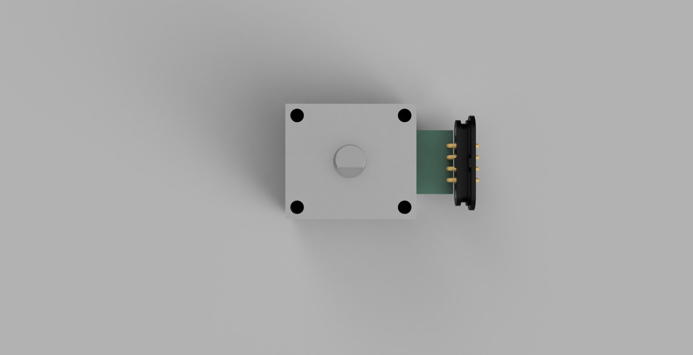
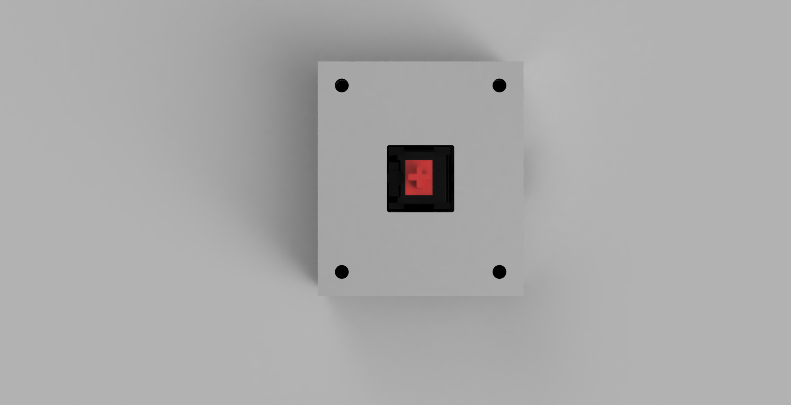
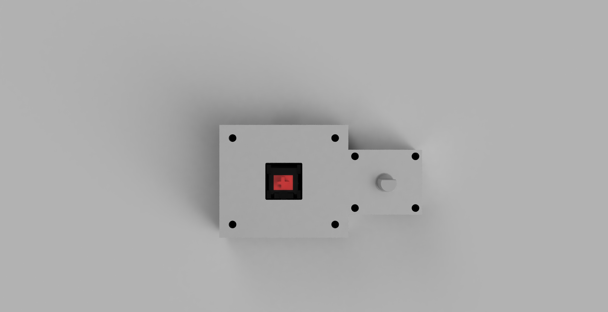
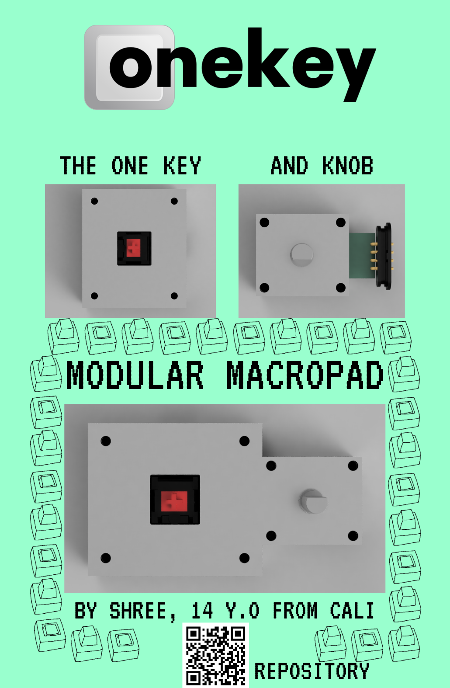

 # The Onekey
 ## The one key and knob macropad(available at onekey.hackclub.com)
 ## Features
 - Sandwhich mount for constistency of feel
 - Magnetic Pogo Pin connectors for easily bonding the two sides of the macropad. 
 - Xiao RP2040 for cost efficiency
 - Neopixel for shiny
## Reasons I built this
 - @maxstellar on slack asked me to help with his internship project, so I did!
## Schematic
These schematics are very concise, it's just a MCU, whatever input device, and magnetic pogo pin connectors(generic symbol). Plus neopixel for key. First one is encoder, second is keyswitch
 - 
 - 
## PCB
 I designed the encoder PCB especially with a lot of care because the pcb had to stick out enough to reach into the case of the main onekey. The pcb with the key also took some time because at first I decided hotswap, but then changed to normal switches. I then made these basically centered. Also I had to work a bit on routing for the neopixel
  ### Keyswitch PCB
  
  ### Encoder PCB
  
## CAD
 I designed the CAD with portability, usability, and elegance in mind. I also had to design it with both a cutout for the USB and pogo pin connector. 
 ### Bottom Case of Encoder
 
 ### Top Plate of Encoder
 
 ### Bottom Case of Keyswitch
 
 ### Top Plate of Keyswitch
 
 ### Encoder Assembly
 
 ### Keyswitch Assembly
 
 ### Full Assembly
 
## Firmware
### The whole point of this YSWS is for people to create their own firmware for a one key macropad, so I don't have firmware here. 
## My Zine

Zine is at zine.pdf too
## Assembly Instructions
 - First, obviously fabricate the PCB and solder everything.
 - Next is printing the plates and cases.
 - This is pretty simple, it was designed with tolerances, you can keep it at basically whatever setting
 - Put heatset inserts through the bottom of the cases
 - Then just screw the pcb and the bottom case together via those
 - Then put the plate on
 - Put the keycap on the switch
 - You have a Onekey!
## BOM
| Description                | Price             | Link                                                                                                                                                                                                                                                                                                                                                                                                                                                                                                                                                                                |
| :------------------------- | :---------------- | :---------------------------------------------------------------------------------------------------------------------------------------------------------------------------------------------------------------------------------------------------------------------------------------------------------------------------------------------------------------------------------------------------------------------------------------------------------------------------------------------------------------------------------------------------------------------------------- |
| Cherry MX Switch           | 0.89              | https://www.aliexpress.com/item/1005012226589276.html?                                                                                                                                                                                                                                                                                                                                                                                                                                                                                                                              |
| Rotary Encoder             | 0.77              | https://www.google.com/aclk?sa=L&ai=DChsSEwiDmf3MwqGVAxVMsgMAHSXIKaQYACICCAEQBhoCb2E&co=1&gclid=CjwKCAjwgO7RBhBKEiwAZNP85rsEmMWYl6g3VWZC5sRsF7ipgr_IHMzRDROKCq-PEOmagNYKbJWF8xoCA8UQAvD_BwE&cid=CAASugHkaLFY9NzucKKfRV9B6g7XEAqV9XkwZMdLsUDu2WDWrsWXZWfksITytF0U-4hzBTNQWbPV-MTb6yh8duZl9zGyLDUE2ipN-ISwgdL_gcXBXNhNxFtpJ2sveYj4UtoBmcYsorckyzbGdYKRD1rP_M9QV_JRDvF--RkA4PA8LLqQ30VgbJ3ZiJvVUGqgRd4tz5SxRPMyOoW_mR5yP6VgMLnE_8iheHBv7Mp09K1dmTv7WgK8nhcIEHBx4jw&cce=1&sig=AOD64_0N9GGjKSBzXkcAyZ8kAby49MiS1g&ctype=5&q=&ved=2ahUKEwiK2PXMwqGVAxUJkGoFHUd8NIgQ5bgDKAB6BAgJEBM&adurl= |
| Xiao RP2040                | 0.7               | https://www.aliexpress.us/item/3256804273304037.html?                                                                                                                                                                                                                                                                                                                                                                                                                                                                                                                               |
| Pair of Magnetic Pogo Conn | 6.5               |                                                                                                                                                                                                                                                                                                                                                                                                                                                                                                                                                                                     |
| PCBs from JLCPCB           | Will Cover Myself |                                                                                                                                                                                                                                                                                                                                                                                                                                                                                                                                                                                     |
| Total                      | 9.31              |                                                                                                                                                                                                                                                                                                                                                                                                                                                                                                                                                                                     |

## Credits
 This project was helped by @owais. Thanks to fallout for sponsoring this!
